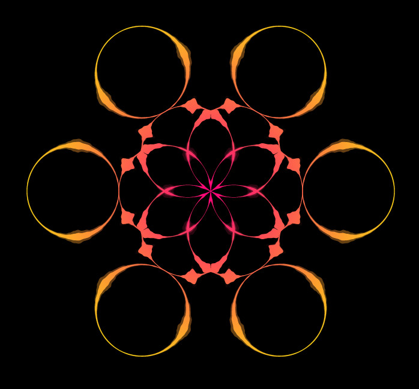

# Audio Scratchboard (Enhanced) for Wallpaper Engine

<p align="center">

<p>

#
### Credits
- [Audio Scratchboard (Steam Workshop)](https://steamcommunity.com/sharedfiles/filedetails/?id=850923796)

#### :warning: WARNING :warning:
*I'm not the original developer of this add-on. This is a modified version of the original source code which may contain bugs!*

Enjoy using ```Audio Scratchboard (Enhanced)``` and want to say thanks? Hit the ⭐️ Star ⭐️ button.
#
### Contributing
*If you know how to improve this project your welcome to submit your pull requests for review.*
#

### Requirements
- [Steam](https://store.steampowered.com/)
- [Wallpaper Engine](https://www.wallpaperengine.io/en)
#

## ⭐ Features ⭐
- Added: Shape - Random option with customizable interval to alternate between different supported shapes. (Not all are currently supported like ```Butterfly``` and ```Hemp```.)
- Added: Shape - Circle Triangle
- Added: Shape - Heart x2
- Added: Shape - Heart x3
- Added: Shape - Triangle
- Added: Shape - Star
- Added: Shape - Test (For debugging & testing purposes.)
#
## Installation
1. Download the ZIP archive and extract it.
2. Run the ```Installer.bat``` file to install the wallpaper.
3. The Audio Scratchboard (Enhanced) wallpaper should appear in Wallpaper Engine.

<p align="center">

<p>

#### Manual Installation
- Go to your Steam installation directory: ```C:\Program Files\Steam\steamapps\common\wallpaper_engine\projects\myprojects\``` and copy all the file contents into a ```AudioScratchboardEnhanced``` folder.

OR

- In Wallpaper Engine click ```Open Wallpaper``` and choose ```Open offline wallpaper``` and select the ```index.html``` file. 
#
### 🐛 Known Bugs 🐛
- Not all ```Default Shapes``` get randomly generated. So I tried rebuilding some of the shapes like the Circle and the Heart shape to make them functional enough. The ```Butterfly``` and ```Hemp``` are missing from the random generation.
- The ```Random Interval Seconds``` is not getting passed from the slider value on change. Simply change the wallpaper and back to update the value.
- The ```Random``` shape remains after changing to another shape. Simply change the wallpaper and back to update the value.

#
### Screenshots

<p align="center">

<p>

<p align="center">

<p>

<p align="center">

<p>

<p align="center">

<p>

<p align="center">

<p>